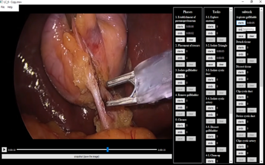

<h1 align="center">
Surgical Video Annotation Software
</h1> 

<h1 align="center">
  
</h1>

## Description

A graphical video annotation tool, originally developed for labeling surgical videos. It is an easy to use software for labeling videos by creating customizable panels for:

- time-stamping the beginning and end of segments such as activities/tasks
- rating the videos/segments based on a custom scoring system
- extracting and saving important frames such as critical views
- pixel-level annotation of the images by opening in [labelme](https://github.com/wkentaro/labelme/) software

## Requirements 

- Python 3
- VLC media-player
- labelme
- PyQT5/OpenCV

## Installation

- Install python 3 (tested on 3.6, 3.7, 3.8, 3.9)

- Install VLC media player

- Install the requirements:

```shell
pip install pyqt5 python-vlc opencv-python labelme
```
or 
```shell
pip install -r requirements.txt
```

- Install the software:

```shell
python3 setup.py install
```

## Usage

run the software:
```shell
surgui
or
python surgui/vidPlayer.py
```

For annotating the start and end of segments, create the .txt file containing the list of segments. Example files can be found in samples folder. In the software, create a timestamping panel by opening the text file. For each video that is playing, a folder with the same name is created in “outputs” directory. By pressing the save button, for each segment, a line will be added to a file in the output folder.

The saved images and the .json files from labelme annotations are stored in “images” folder for each video.


## TODO

- scripts for plotting the outputs
- create conda package
- upload the executables